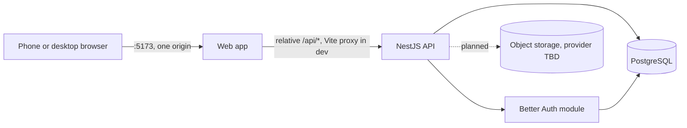

# Architecture Overview

A map of the codebase: where things live and how they connect. The reasoning behind each choice lives in [`docs/adr/`](adr/), and each section links the decisions it rests on. A change to any of these changes by pull request, in the same PR as the code.

## 1. Project Structure

```
/
├── apps/
│   ├── web/              React SPA (Vite)
│   └── api/              NestJS API on Node; openapi.ts + auth/auth.openapi.ts serve /api/docs, drizzle/ the migrations
├── packages/shared/      Zod schemas and types both apps agree on; built to dist/ before anything else
├── docs/                 ARCHITECTURE.md, data-model.md, requisitos.md (pt-BR product spec), adr/, agents/
├── docker/postgres/      init script that creates the test database
├── .github/              CI workflow and PR template
├── CONTEXT.md            domain glossary
└── docker-compose.yml    local Postgres
```

A Bun workspaces monorepo; Bun runs scripts, the API runs on Node ([0001](adr/0001-bun-workspaces-node-runtime.md)).

### `apps/web/src`

```
routes/          TanStack Router file-based route tree
features/<x>/    everything that belongs to ONE screen: components, hooks, api.ts; barrel at the root
components/ui/   shadcn/ui, generated by the CLI
components/      reusable components used by 2+ features
lib/             stateful or talks to the world: HTTP client, queryClient, cn()
utils/           pure functions, no state or I/O
styles/          globals.css: Tailwind and theme tokens
```

- **A route file is thin**: `validateSearch`, `loader`, `beforeLoad` (auth guard) and `errorComponent` live there; rendering is imported from `features/`. `routes/` includes `__root.tsx` and layout routes that render no UI of their own.
- **A component moves from `features/<x>/` to `components/` when a second feature needs it**, never before; that is what keeps everything in `components/` reusable by definition.
- **API calls and TanStack Query hooks** live in `features/<x>/api.ts`, using `queryOptions` and `apiFetch` from `src/lib/api.ts`.
- **A type or schema moves to `packages/shared` when the web app and the API must agree on it** (a request/response contract, a domain enum). A form's validation schema stays in its feature.
- `index.html` is the entry point Vite processes, not a static asset.

### `apps/api/src`

```
main.ts          creates the Nest app, applies configureApp, opens the port
app.ts           configureApp(app) + nestApplicationOptions: prefix, helmet, CORS, validation pipe,
                 serializer, error filter; tests use both, so no contract only holds in production
app.module.ts    root module: ConfigModule (env validated at boot) and domain modules
openapi.ts       builds and serves the OpenAPI document at /api/docs, merging auth/auth.openapi.ts by hand
auth/            Better Auth instance, the module that mounts it, and its hand-written OpenAPI paths
<domain>/        one module per domain: controller, service, module, dto/, <domain>.queries.ts
common/          cross-cutting filters, pipes, guards, interceptors; problems/ holds the error contract
db/              DatabaseModule: pool, Drizzle instance, schema, boot connection check
lib/             stateful or talks to the world: env schema, clients
utils/           pure functions, no state or I/O
```

- **The module is the unit of organization, not the layer**: `controllers/` and `services/` at the root spread one domain over three places.
- **Controller** declares the route, validates input through a DTO and calls the service. **Service** holds business logic and never touches Express. **Queries** hold all database access as functions that take the executor ([0005](adr/0005-queries-take-the-executor.md)). `DatabaseModule` is `@Global()`, exports Drizzle under the `DATABASE` token and checks the connection at boot ([0006](adr/0006-database-check-at-boot.md)).
- **Contracts**: request DTOs wrap shared schemas ([0003](adr/0003-shared-zod-via-nestjs-zod.md)); every route declares a response DTO ([0004](adr/0004-response-dto-on-every-route.md)); every error is RFC 9457 problem details with a stable `code`, thrown as `ProblemException` ([0047](adr/0047-errors-are-rfc-9457-problem-details.md)). Conventions and gotchas: `.claude/rules/api.md`.
- **`lib/` vs `utils/`**: `lib/` *is* something (state or I/O), `utils/` is pure and testable without mocks. Only what another module injects becomes `@Injectable()`.

### `packages/shared/src`

One folder per domain with its `index.ts` (`health/`, `projects/`) and one file per contract, named after the DTO that consumes it minus `.dto` (`health/health-query.ts` backs `apps/api/src/health/dto/health-query.dto.ts`). What crosses domains sits at the root (`roles.ts`). Never a folder per kind (`requests/`, `responses/`). Every consumer imports from `@bluprint/shared`, so moving a file inside the package changes no import outside it.

## 2. High-Level System Diagram



The browser only ever sees one origin, so the session cookie is first-party ([0009](adr/0009-single-origin-api-prefix-and-proxy.md)). The API mounts everything under `/api`; `apiFetch` adds the prefix, so its callers pass `/health`, while the OpenAPI document and integration tests use `/api/health`.

## 3. Core Components

### 3.1 Web (`apps/web`)

The interface for engineers in the field (phone) and in the office (desktop), mobile-first ([0037](adr/0037-mobile-first-web-app.md)).

| Concern | Choice |
| --- | --- |
| Framework | React + Vite + Tailwind v4 (`@tailwindcss/vite`) |
| Routing / data | TanStack Router · TanStack Query v5 |
| Forms | React Hook Form + Zod v4 |
| UI | shadcn/ui over Radix · lucide-react |

### 3.2 API (`apps/api`)

Serves the web app's contracts, enforces authentication and per-project authorization, and owns the database.

| Concern | Choice |
| --- | --- |
| Framework | NestJS, Express adapter ([0002](adr/0002-nestjs-over-hono.md)) |
| Validation | Zod v4 from `packages/shared` via `nestjs-zod` ([0003](adr/0003-shared-zod-via-nestjs-zod.md)) |
| ORM | Drizzle with `node-postgres` |
| Auth | Better Auth, self-hosted ([0010](adr/0010-self-hosted-better-auth.md)) |
| API docs | OpenAPI via `@nestjs/swagger`, served at `/api/docs` ([0046](adr/0046-openapi-via-nestjs-swagger.md)) |

### 3.3 Shared (`packages/shared`)

The Zod schemas and types both apps validate against. TypeScript everywhere, strict base `tsconfig` (`apps/api` leaves it for decorators). React/Vite/Tailwind, TanStack, React Hook Form, shadcn/ui and Drizzle have no rejected alternative worth recording: they are the ecosystem default for their role.

## 4. Data Stores

### 4.1 PostgreSQL

Primary database, Drizzle schema in `apps/api/src/db/schema/`, migrations in `apps/api/drizzle/`. Migrated tables: Better Auth's `user`, `session`, `account`, `verification` ([0013](adr/0013-better-auth-tables-are-generated.md)) plus `organization`, `member`, `license`, `project`, `project_member`. The designed model and its reasoning: [`data-model.md`](data-model.md). Provider TBD; local container in development.

### 4.2 Object storage

Plan images and pin photos, behind a generic S3-compatible API. Provider TBD ([0015](adr/0015-hosting-and-providers-deferred.md)); nothing stores files yet.

## 5. External Integrations / APIs

None yet. Better Auth is a library inside the API, not a service. A transactional email provider arrives with invitations (#11).

## 6. Deployment & Infrastructure

- **Hosts and providers**: open until the first deploy ([0015](adr/0015-hosting-and-providers-deferred.md)). Settled: the API is a long-lived process ([0016](adr/0016-api-is-a-long-lived-process.md)), and the web app and API share one registrable domain ([0009](adr/0009-single-origin-api-prefix-and-proxy.md)).
- **CI**: GitHub Actions, one `ci` job running the root scripts against a Postgres service container ([0018](adr/0018-ci-runs-root-scripts.md)).
- **Runtime floor**: Node 24.9+ for the API ([0014](adr/0014-node-24-9-floor.md)).
- **Monitoring & logging**: not yet.

## 7. Security Considerations

- **Authentication**: email and password through Better Auth; `httpOnly`, `SameSite=Lax` session cookie valid 90 days, renewed per day of use ([0010](adr/0010-self-hosted-better-auth.md)). Self-signup is scaffolding, off by default ([0011](adr/0011-self-signup-is-scaffolding.md)).
- **Authorization**: a global `AuthGuard` protects every route; `@AllowAnonymous()` opts one out, and only `health` does. Roles are read from the project membership ([0022](adr/0022-roles-live-on-project-membership.md)); response DTOs strip fields outside the contract ([0004](adr/0004-response-dto-on-every-route.md)).
- **Defenses**: `helmet`; `trustedOrigins` against CSRF; Better Auth's rate limit written out as 5 sign-in attempts per minute per IP, with a known gap until a proxy is chosen (#21); `BETTER_AUTH_SECRET` required by `envSchema`, so the API refuses to boot without it.
- **Platform admin** never sees project content ([0021](adr/0021-platform-admin-sees-only-metadata.md)).
- **API docs** (`/api/docs`) are on by default in development and off in production, via `API_DOCS_ENABLED` ([0046](adr/0046-openapi-via-nestjs-swagger.md)).

## 8. Development & Testing Environment

- **Setup**: `docker compose up -d --wait`, then `bun run dev` (web :5173, API :3000). One `.env` at the root serves both apps.
- **Tests**: Vitest + Testing Library in web; Jest + Supertest in the API ([0007](adr/0007-jest-for-api-vitest-for-web.md)). In the API, `*.spec.ts` is unit-only (no database, no HTTP; mock the injected dependency, never Drizzle's query-builder chain) and `*.int-spec.ts` boots the real `AppModule` against Postgres. `test:unit` never needs the container.
- **Migrations**: `drizzle-kit migrate` only reads `DATABASE_URL`. After pulling a new migration, run it against `DATABASE_URL_TEST` too, or `test:int` fails with `relation ... does not exist` while CI is green.
- **Lint/format**: Biome in web and shared; ESLint + Prettier in the API ([0008](adr/0008-eslint-in-api-biome-elsewhere.md)).
- **Naming**: PascalCase for React component files, named after their export (`StatCard.tsx`); camelCase for everything else, feature folders included (`features/adminDashboard/`). Two tool-imposed exceptions: `components/ui/` is kebab-case (shadcn CLI), and `routes/` follows TanStack Router syntax (`admin.dashboard.tsx`, `$projectId.tsx`: a dot separates segments, `$` marks a parameter).
- **Commits**: Conventional Commits in the imperative, `type(scope): subject`. Scope is the workspace (`api`, `web`, `shared`), omitted for repo-wide changes. Types in use: `feat`, `fix`, `docs`, `refactor`, `chore`, `test`, `ci`. The body explains why, not what. A `commit-msg` git hook enforces the type list ([0045](adr/0045-local-git-hooks-with-lefthook.md)); adding a type means updating both this line and `lefthook.yml`'s regex.
- **Local git hooks**: Lefthook ([0045](adr/0045-local-git-hooks-with-lefthook.md)), installed by `bun install`. Lint on commit (staged files only), typecheck + unit tests on push. CI ([0018](adr/0018-ci-runs-root-scripts.md)) is still the real gate; hooks are bypassable with `--no-verify`.
- **Errors in the UI**: the API answers problem details in English; `apiFetch` throws an `ApiError` carrying them, and a screen maps `problem.code` to pt-BR, never `detail` ([0047](adr/0047-errors-are-rfc-9457-problem-details.md)).

## 9. Future Considerations / Roadmap

- **Rendering plans with pins**: decided in the plan epic (#7/#8), with real plans and volume in hand; expect ~100–300 pins per plan, not thousands.
- **Image handling**: client or server compression, direct upload to storage or through the API, what to do with PDFs. Same epic.
- **Removing self-signup** and the sign-up seeding hook with invitations (#11/#12, [0012](adr/0012-signup-seeding-as-compensated-saga.md)).

## 10. Project Identification

- **Project**: BluPrint
- **Repository**: https://github.com/BluPrint-Engineering/bluprint-app

## 11. Glossary

See [`CONTEXT.md`](../CONTEXT.md).
